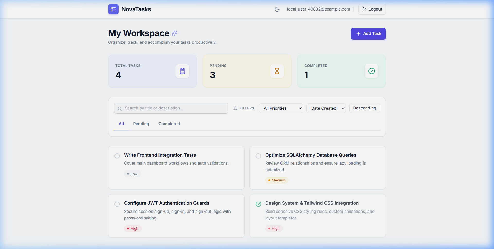
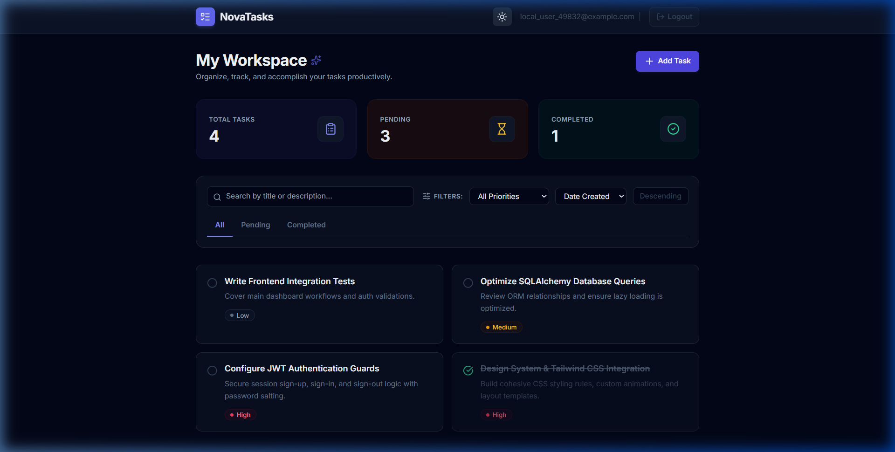
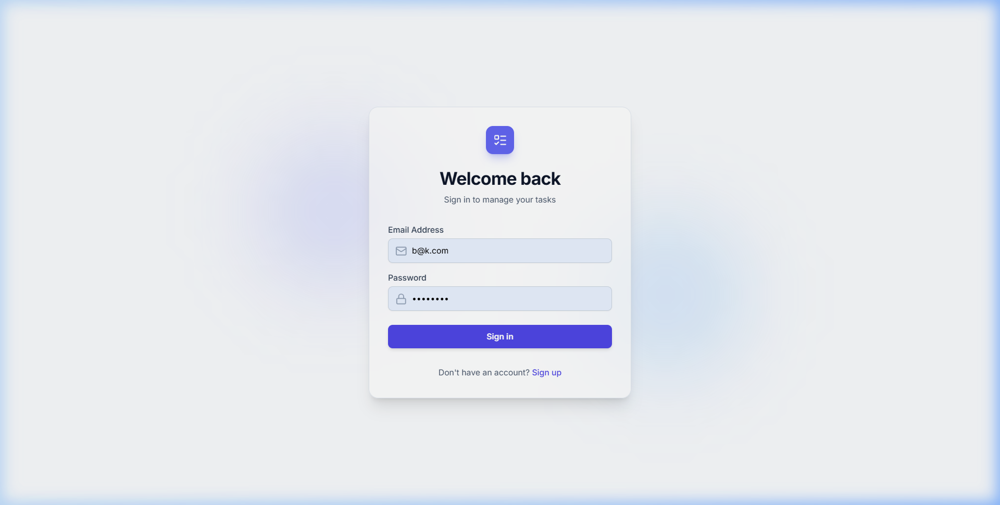
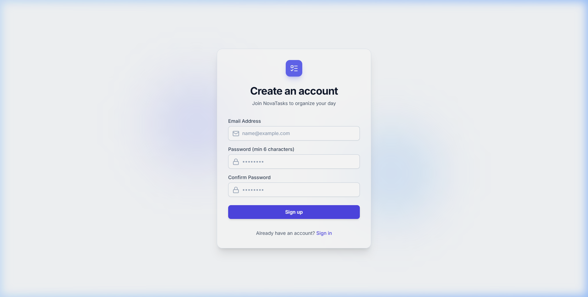

# NovaTasks - Modern Task Management Application

NovaTasks is a production-quality, responsive full-stack task management application. The app offers secure user authentication via JSON Web Tokens (JWT) and complete CRUD operations for tasks with real-time searching, category status tabs, priority categorization, sorting parameters, and a persistent dark/light interface theme.

---

## Technical Badges


---

## Live Demo Links

- **Frontend App:** [https://novatasks.vercel.app](https://novatasks.vercel.app)
- **Backend API:** [https://novatasks-api.onrender.com](https://novatasks-api.onrender.com)
- **Interactive Documentation:** [https://novatasks-api.onrender.com/docs](https://novatasks-api.onrender.com/docs) *(Swagger UI docs)*

---

## Key Features

- **Secure JWT Authentication:** Session sign-up, sign-in, and sign-out logic with password salting (`passlib`/`bcrypt`) and bearer token guards.
- **Complete Task Management:** Create, update, complete, search, filter, and delete tasks.
- **Analytics Stats Summary:** Live counter cards showing total, pending, and completed tasks.
- **Interactive Productivity Tools:**
  - *Debounced Search:* Real-time searching of task titles and descriptions.
  - *Status Filter Tabs:* Group views for All, Pending, and Completed tasks.
  - *Priority Badging:* Sort views for Low, Medium, and High categories.
  - *Advanced Sorting:* Order tasks dynamically by date created, due date, priority, or alphabetical order.
- **Rich Polish & Dark Mode:** Responsive layout with dark/light mode toggle persistent across sessions.
- **UX Confirmations & Toasts:** Actions such as deletion prompt verification modal dialogs; operations display feedback notifications via `react-hot-toast`.

---

## Screenshots

*(Upload your captured app images to the `/docs` directory inside the repository to display them here)*

### 1. Light Theme Workspace


### 2. Dark Theme Workspace


### 3. Login & Signup Modals
| Login Page | Register Page |
| :---: | :---: |
|  |  |

---

## Technical Stack

- **Frontend:** **React 19 + Vite** – Modern frontend library with Vite for fast development and optimized builds, incorporating Tailwind CSS, React Router v6, TanStack Query v5, React Hook Form, Zod, Axios, React Hot Toast, and Lucide React.
- **Backend:** **FastAPI** – High-performance ASGI framework incorporating SQLAlchemy ORM, SQLite database, python-jose, and passlib (bcrypt) for authentication.
- **Deployment:** Vercel (Frontend), Render (Backend)

---

## Folder Structure

```text
NovaTasks/
  ├── backend/
  │   ├── app/
  │   │   ├── models/            # SQLAlchemy database schemas
  │   │   ├── routers/           # FastAPI versioned endpoints
  │   │   ├── schemas/           # Pydantic request & response validators
  │   │   ├── auth.py            # Password hashing & JWT dependencies
  │   │   ├── config.py          # Configuration and .env loader
  │   │   ├── database.py        # SQLite database connection setup
  │   │   └── main.py            # FastAPI main entry point & CORS
  │   ├── requirements.txt
  │   └── .env
  ├── frontend/
  │   ├── src/
  │   │   ├── api/               # Axios services
  │   │   ├── components/        # Reusable UI widgets
  │   │   ├── context/           # Auth Session context
  │   │   ├── pages/             # Authentication & Dashboard screens
  │   │   ├── utils/             # Validation & error parsing utilities
  │   │   ├── App.jsx            # Routing and provider wrappers
  │   │   ├── index.css          # Tailwind base & custom transitions
  │   │   └── main.jsx
  │   ├── package.json
  │   ├── tailwind.config.js
  │   └── postcss.config.js
  ├── README.md
  └── .gitignore
```

---

## Setup & Running the Application

### Prerequisites
- **Python 3.10+**
- **Node.js 18+** & **npm**

### 1. Backend Setup (FastAPI)
1. Navigate to the `backend` folder:
   ```bash
   cd backend
   ```
2. Create a virtual environment:
   ```bash
   python -m venv .venv
   ```
3. Activate the virtual environment:
   - **Windows (PowerShell):**
     ```powershell
     .\.venv\Scripts\Activate.ps1
     ```
   - **macOS / Linux:**
     ```bash
     source .venv/bin/activate
     ```
4. Install backend dependencies:
   ```bash
   pip install -r requirements.txt
   ```
5. Create a `.env` file in the `backend/` directory:
   ```env
   SECRET_KEY=your-production-secret-key-change-this
   ACCESS_TOKEN_EXPIRE_MINUTES=60
   FRONTEND_URL=http://localhost:5173
   ```
6. Run the FastAPI development server:
   ```bash
   python -m uvicorn app.main:app --reload
   ```
   *The API will run at `http://127.0.0.1:8000`. You can visit `http://127.0.0.1:8000/docs` to view the interactive Swagger UI API documentation.*

### 2. Frontend Setup (React 19 + Vite)
1. Navigate to the `frontend` folder:
   ```bash
   cd frontend
   ```
2. Install frontend dependencies:
   ```bash
   npm install
   ```
3. Create a `.env` file in the `frontend/` directory (optional - defaults to local port 8000):
   ```env
   VITE_API_URL=http://localhost:8000/api/v1
   ```
4. Run the Vite development server:
   ```bash
   npm run dev
   ```
   *The client application will run at `http://localhost:5173`.*

---

## API Endpoints Reference

All paths are prefixed by `/api/v1`.

### Diagnostics
- **`GET /health`** - System check for Render/health-monitors.

### Authentication
- **`POST /auth/register`** - Registers a new user. Enforces unique email check and password >= 6 characters.
- **`POST /auth/login`** - Log in and returns a JWT token.
- **`GET /auth/me`** - Retrieves details of the currently logged-in user.

### Tasks (Protected by JWT Bearer auth)
- **`GET /tasks`** - Fetch tasks for the current user. Supports:
  - Filtering: `status` (`pending`/`completed`), `priority` (`low`/`medium`/`high`)
  - Searching: `search` (real-time query matching title or description)
  - Sorting: `sort_by` (`created_at`/`due_date`/`priority`/`title`), `sort_order` (`asc`/`desc`)
- **`POST /tasks`** - Create a new task.
- **`PUT /tasks/{id}`** - Updates details or toggles completion status.
- **`DELETE /tasks/{id}`** - Deletes a task.

---

## Database Entity Relationship Diagram

```text
  +------------------+          +-------------------+
  |      USERS       |          |      TASKS        |
  +------------------+          +-------------------+
  | id (PK, Int)     |          | id (PK, Int)      |
  | email (Unique)   |--------->| owner_id (FK)     |
  | hashed_password  |          | title (Varchar)   |
  | is_active (Bool) |          | description (Text)|
  +------------------+          | status (Varchar)  |
                                | priority (Varchar)|
                                | due_date (DateTime|
                                | created_at        |
                                | updated_at        |
                                +-------------------+
```

---

## Future Improvements

- **Email Verification:** Mandate account activation via validation links.
- **Password Reset Flows:** Secure self-service recovery via email verification tokens.
- **Team Workspaces:** Collaborative boards supporting task assignments, shared lists, and team-based view filters.
- **Task Attachments:** Upload supporting media, files, or links directly to task descriptions.
- **Real-time Event Notifications:** Push alert summaries or daily digests for due/overdue items.
- **Subtasks Lifecycle:** Expand task details to support child checklists and nested step trackers.
